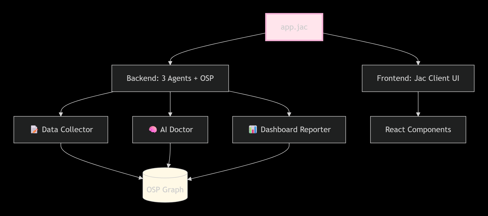

## 🤰 MaternAI
1 file. 4 agents. Infinite care.

⚡ What Is It?
MaternAI = Backend + Frontend in ONE .jac file

Four AI agents collaborate through an OSP graph to monitor maternal health, detect risks, and generate recommendations—all in a single file using Jac Client for the UI.

Traditional Stack	MaternAI
Backend server	
Frontend code	app.jac
API layer	
= 4+ files	= 1 file
🎯 The Stack

📍 What / Where
Section	Description
Lines 1–50	OSP Graph structure

Lines 51–120	Agent 1: Data Collector – records metrics

Lines 121–230	Agent 2: AI Doctor – analyzes risks

Lines 231–350	Agent 3: Dashboard Reporter – fetches data

Lines 351–520	Jac Client React components

🚀 Run It (10 seconds)
bash
# Install Jac
pip install jaclang

# Get the file
git clone https://github.com/kamau552/maternai

cd maternai

# Run (starts backend + serves frontend)
jac run app.jac

# Open your browser:
http://localhost:8000
That's it.
One file. One command. Full stack.

💻 How It Works
Backend (OSP + Agents)
jac
# Define graph structure
node Patient { has name: str; has age: int; has pregnancy_week: int; }
node HealthMetric { has value: float; has is_abnormal: bool; }
node RiskReport { has severity: str; has summary: str; }

# Agent walks the graph
walker recorder {
    has patient_id: str;
    has metric_type: str;
    has value: float;
    
    can record_metric with root entry {
        # Find or create patient
        patient_node = spawn here --> Patient(name=self.patient_id);
        # Create metric edge
        patient_node ++> HealthMetric(value=self.value);
        report {"status": "recorded"};
    }
}
Frontend (Jac Client)
jac
cl {
    import from react { useState, useEffect }
    
    def Dashboard() -> any {
        let [data, setData] = useState(None);
        
        def refreshData() -> None {
            result = spawn root reporter(patient_id="Sarah");
            setData(result.reports[0]);
        }
        
        useEffect(lambda -> None { refreshData(); }, []);
        
        return 

            <h1>🤰 MaternAI</h1>
            <PatientInfo patient={data.patient} />
        
;
    }
}
No API calls. No REST. Just spawn.

🎨 The Interface
text
╔════════════════════════════════════════╗
║  🤰 MaternAI                           ║
║  [3 AGENTS] [OSP GRAPH] [JAC CLIENT]  ║
╠════════════════════════════════════════╣
║  👤 Sarah, 30  │  Week 20  │  Risk: Medium ║
╠════════════════════════════════════════╣
║  💓 BP: 145 mmHg (ABNORMAL)            ║
║  🩸 Glucose: 95 mg/dL ✓                ║
╠════════════════════════════════════════╣
║  🚨 AI Risk Analysis  [🧠 Analyze]     ║
║  • High BP detected - seek immediate care ║
╠════════════════════════════════════════╣
║  [📊 Dashboard] [➕ Add Metric]        ║
╚════════════════════════════════════════╝

➕ Add Metric Flow

text

User clicks "Add High BP (145)"
        ↓
spawn root recorder(
    patient_id="Sarah",
    metric_type="BP Systolic",
    value=145.0,
    unit="mmHg"
)
        ↓
Agent creates HealthMetric node → links to Patient
        ↓
Dashboard auto-refreshes via useEffect

🧠 AI Analysis Flow
text
User clicks "Run New Analysis"
        ↓
spawn root doctor_ai(patient_id="Sarah")
        ↓
Graph traversal → collects all metrics
        ↓
Computes risk patterns → creates RiskReport
        ↓
Dashboard updates with new analysis

🔥 Why One File?
Problem: Complexity in normal stacks

Backend server config

Database setup

API endpoints

CORS configuration

Frontend build tools

State synchronization

Solution: Jac

jac
# Backend
walker GetData { can fetch with Patient { ... } }

# Frontend
cl { def UI() { result = spawn root GetData(); } }
Everything communicates through the graph, not HTTP.

✅ Hackathon Checklist
Requirement	Location	Status
Multi-Agent (2–3+)	3 agents (51–350)	✅
OSP Graph Reasoning	Risk scoring (121–230)	✅
Named Nodes/Edges	Patient, Metric, Risk	✅
Jac Client	React-style UI	✅
Single File	app.jac	✅
🛠️ Quick Fixes
bash
# Not starting?
pip install --user jaclang
export PATH="$HOME/.local/bin:$PATH"
jac run app.jac

# Port conflict?
jac run app.jac --port 8001

# Visualize graph

jac dot app.jac | dot -Tpng -o graph.png
📁 Project Structure
text
maternai-app/
├── app.jac       ← Everything (520 lines)
└── README.md     ← This file

🎓 Key Concepts
OSP Graph
jac
# Traditional way (multiple DB queries)
GET /patients/Sarah
GET /patients/Sarah/metrics
GET /patients/Sarah/risks

# Jac/OSP way
for edge in patient.out_edges {
    if edge.type == "has_metric" { ... }
    if edge.type == "has_risk" { ... }
}
Jac Client
jac
result = spawn root MyAgent(arg="value");
Multi-Agent
Data Collector – records health metrics

AI Doctor – analyzes risks, generates recommendations

Dashboard Reporter – fetches data for UI

🔮 Extend It
jac
walker NewAgent {
    has some_param: str;
    
    can do_something with Patient entry {
        report {"result": "success"};
    }
}
Call it:

jac

result = spawn root NewAgent(some_param="value");

##👩‍💻 Credits

Built by: Faith Kamau
Research: Felix Kipkemoi, Barbara Musumba, Stephen Oloo, Henry Muema, Gloria Shikuku
For: AI Hackathon 2024
Tech: Jac Language (OSP + Client)

Thanks:
Jaseci Labs · Kugesan · Udith · Thaami · Malitha

 💖 One file. Three agents. Infinite care. MaternAI · Maternal health monitoring reimagined 

